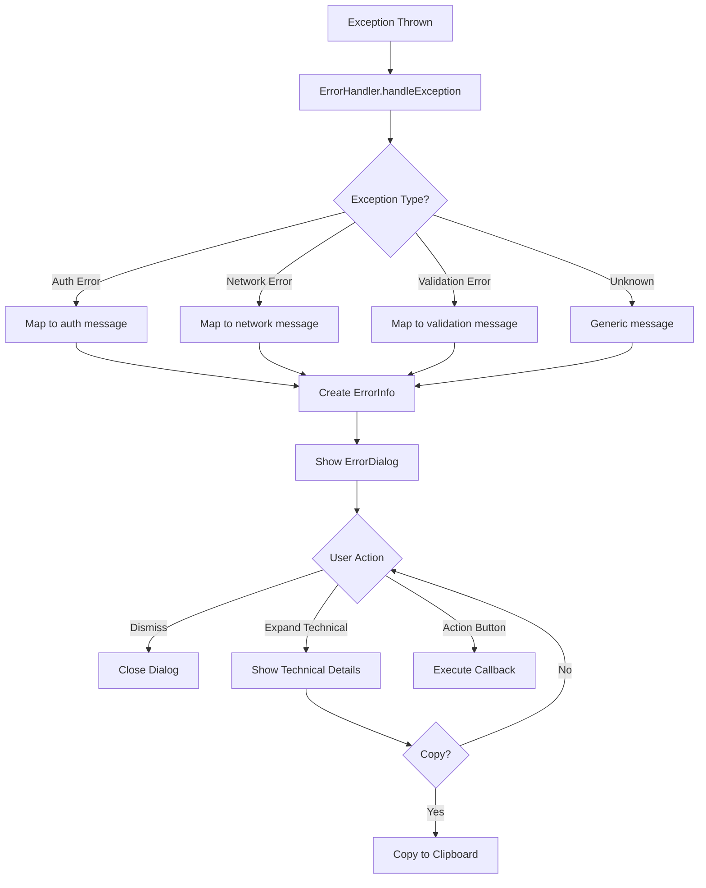

# Error Popup Improvement Plan

## Overview
Improve error popups to show user-friendly messages by default, with an expandable technical details section for developers. Also enhance the UI design for a more modern, polished look.

## Current State Analysis

### Existing Components
- **[`ErrorHandler`](lib/core/services/error_handler.dart)** - Centralized error handling service
- **[`ErrorDialog`](lib/core/widgets/error_dialog.dart)** - Basic error dialog widget
- **[`status_dialogs.dart`](lib/core/widgets/status_dialogs.dart)** - Contains SuccessDialog, WarningDialog, ConfirmationDialog

### Current Issues
1. Technical error details shown directly to users
2. Basic UI design without animations
3. Inconsistent error handling (mix of ErrorHandler and raw SnackBar)
4. No way to view technical details when needed for debugging

---

## Proposed Design

### 1. Enhanced Error Dialog UI

```
┌─────────────────────────────────────────┐
│                                         │
│            ┌─────────┐                  │
│            │   ❌    │  ← Animated icon │
│            └─────────┘                  │
│                                         │
│         Something Went Wrong            │  ← User-friendly title
│                                         │
│   Unable to sign in. Please check       │  ← User-friendly message
│   your credentials and try again.       │
│                                         │
│  ┌─────────────────────────────────────┐│
│  │ 🔧 Show Technical Details      [▼] ││  ← Expandable toggle
│  └─────────────────────────────────────┘│
│                                         │
│  ┌─────────────────────────────────────┐│
│  │ Technical Details:                  ││  ← Collapsed by default
│  │ Exception: FirebaseAuthException:   ││
│  │ wrong-password                      ││
│  │ Stack trace: ...                    ││
│  └─────────────────────────────────────┘│
│                                         │
│     [Dismiss]         [Try Again]       │
│                                         │
└─────────────────────────────────────────┘
```

### 2. UI Improvements

#### Visual Enhancements
- **Animated icon entrance** - Scale and fade animation when dialog opens
- **Glass morphism design** - Match the app's liquid glass design system
- **Color-coded borders** - Red for errors, green for success, yellow for warnings
- **Subtle glow effects** - Shadow matching the dialog type
- **Rounded corners** - Consistent with app design (16px radius)

#### Interaction Improvements
- **Expandable technical section** - Tap to expand/collapse
- **Copy technical details** - Long press or button to copy
- **Haptic feedback** - On error display and button presses

### 3. Error Message Mapping

Create comprehensive error type mappings based on actual app errors:

#### Authentication Errors

| Technical Error Pattern | User-Friendly Message |
|------------------------|----------------------|
| `invalid_login_credentials` | Unable to sign in. Please check your email and password. |
| `invalid credentials` | Invalid email or password. Please try again. |
| `user_already_exists` | This email is already registered. Try signing in instead. |
| `already exists` / `duplicate` / `registered` | An account with this email already exists. |
| `email_not_confirmed` | Please verify your email before signing in. |
| `Please verify your email with OTP` | Please verify your email with the OTP sent to continue. |
| `Authentication sync failed` | Sign in failed. Please try again. |
| `Not authenticated` | Please sign in to continue. |
| `No authenticated user` | Your session has expired. Please sign in again. |
| `sign up failed` | Could not create account. Please try again. |
| `sign-out warning` | Session ended. Please sign in again. |

#### OTP & Verification Errors

| Technical Error Pattern | User-Friendly Message |
|------------------------|----------------------|
| `Invalid OTP` | The code you entered is incorrect. Please try again. |
| `Failed to send OTP` | Could not send verification code. Please try again. |
| `OTP expired` | Your verification code has expired. Please request a new one. |

#### Network & Server Errors

| Technical Error Pattern | User-Friendly Message |
|------------------------|----------------------|
| `Network` / `network_error` | No internet connection. Please check your network settings. |
| `Connection refused` | Unable to connect to server. Please try again later. |
| `Timeout` / `timeout` | Request took too long. Please try again. |
| `Backend unavailable` | Service temporarily unavailable. Please try again later. |
| `PGRST202` / `schema cache` | Server is updating. Please try again in a moment. |

#### Validation Errors

| Technical Error Pattern | User-Friendly Message |
|------------------------|----------------------|
| `Password should be` / `weak_password` | Password must be at least 8 characters with letters and numbers. |
| `invalid_email` / `Invalid email` | Please enter a valid email address. |
| `Name cannot be empty` | Please enter your name. |
| `Name is too long` | Name must be 32 characters or less. |
| `Fill both fields` | Please fill in all required fields. |
| `Password too short` | Password is too short. Use at least 8 characters. |

#### Image & Upload Errors

| Technical Error Pattern | User-Friendly Message |
|------------------------|----------------------|
| `Image size must be less than 5MB` | Photo is too large. Please choose a smaller image. |
| `Only JPG, PNG, and GIF` | Unsupported image format. Please use JPG, PNG, or GIF. |
| `Upload failed` | Could not upload image. Please try again. |
| `Delete failed` | Could not delete image. Please try again. |
| `Invalid ImageKit URL` | Image URL is invalid. Please try a different image. |

#### Territory & Map Errors

| Technical Error Pattern | User-Friendly Message |
|------------------------|----------------------|
| `Not enough points to form a polygon` | Territory is too small. Keep running to expand your area. |
| `Territory too small` | Territory must be at least 200 square meters. |
| `Territories RPC is outdated` | App needs an update. Please contact support. |

#### Profile & Account Errors

| Technical Error Pattern | User-Friendly Message |
|------------------------|----------------------|
| `Failed to delete account` | Could not delete account. Please try again. |
| `Password updated` | Password changed successfully! |
| `Export failed` | Could not export your data. Please try again. |
| `No runs to export` | No running data available to export. |

#### Post & Feed Errors

| Technical Error Pattern | User-Friendly Message |
|------------------------|----------------------|
| `Failed to create post` | Could not create post. Please try again. |
| `Failed to like post` | Could not like post. Please try again. |
| `Failed to add comment` | Could not add comment. Please try again. |

#### Run & Activity Errors

| Technical Error Pattern | User-Friendly Message |
|------------------------|----------------------|
| `Failed to save run` | Could not save your run. Please try again. |
| `Failed to delete run` | Could not delete run. Please try again. |
| `Custom run updated` | Run updated successfully! |
| `Custom run added` | Run added successfully! |

#### Generic Fallback

| Technical Error Pattern | User-Friendly Message |
|------------------------|----------------------|
| `Exception:` prefix | Remove prefix and show cleaned message |
| Unknown error | Something went wrong. Please try again later. |
| Any error > 200 chars | Truncate with "..." and show technical details option |

---

## Implementation Details

### Files to Modify

1. **[`lib/core/widgets/error_dialog.dart`](lib/core/widgets/error_dialog.dart)**
   - Add `technicalDetails` parameter
   - Add expandable section with animation
   - Improve UI styling
   - Add copy functionality

2. **[`lib/core/services/error_handler.dart`](lib/core/services/error_handler.dart)**
   - Store original exception for technical details
   - Enhanced `_extractErrorMessage()` method
   - Pass both user-friendly and technical messages

3. **[`lib/core/widgets/status_dialogs.dart`](lib/core/widgets/status_dialogs.dart)**
   - Update styling to match new error dialog design
   - Add consistent animations

### New Components

1. **Error Type Enum**
```dart
enum AppErrorType {
  authentication,
  network,
  validation,
  server,
  permission,
  unknown,
}
```

2. **Error Info Class**
```dart
class ErrorInfo {
  final String userFriendlyMessage;
  final String technicalDetails;
  final AppErrorType type;
  final String? code;
  
  const ErrorInfo({...});
}
```

### Animation Specifications

```dart
// Icon animation
AnimatedScale(
  duration: Duration(milliseconds: 300),
  curve: Curves.elasticOut,
  child: Icon(...),
)

// Technical details expand/collapse
AnimatedSize(
  duration: Duration(milliseconds: 200),
  curve: Curves.easeInOut,
  child: technicalSection,
)

// Dialog entrance
FadeTransition + SlideTransition
Duration: 200ms
Offset: from (0, 0.1) to (0, 0)
```

---

## Workflow Diagram



---

## Consistency Updates

### SnackBar Replacements

Replace raw SnackBar usage with unified notification system:

| Current Usage | New Approach |
|--------------|--------------|
| `ScaffoldMessenger.of(context).showSnackBar(SnackBar(content: Text(e.toString())))` | `ErrorHandler.handleException(context, e)` |
| Success SnackBar | `ErrorHandler.showSuccessDialog()` or `AppToast.success()` |
| Simple info SnackBar | `AppToast.info()` |

---

## Testing Checklist

- [ ] All error types show user-friendly messages
- [ ] Technical details expand/collapse works correctly
- [ ] Copy technical details to clipboard works
- [ ] Animations play smoothly
- [ ] Dialog dismisses correctly
- [ ] Action buttons execute callbacks
- [ ] Works in both light and dark themes
- [ ] Haptic feedback triggers appropriately

---

## Implementation Order

1. Update `ErrorDialog` widget with new UI and expandable section
2. Enhance `ErrorHandler` with better message extraction
3. Update `status_dialogs.dart` for consistent styling
4. Replace raw SnackBar usage throughout the app
5. Test all error scenarios
